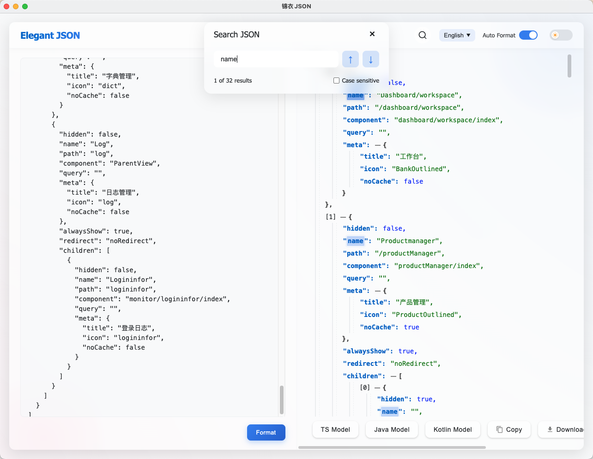

# JSON 格式化工具

一款美观实用的 Chrome 扩展，用于格式化和可视化 JSON 数据。

## 项目结构

```json-formatter/
├── locales/ # 国际化语言包
├── icons/ # 图标资源
├── popup/ # 弹出窗口相关文件
├── scripts/ # 核心脚本文件
├── styles/ # 样式表文件
└── manifest.json # 扩展配置文件
```

## 功能特点

- 美观的用户界面，支持明暗两种主题
- 可展开和折叠任意层级的 JSON 数据
- 支持搜索 JSON 内容，并高亮显示匹配项
- 可复制整个 JSON 或任意层级的数据
- 可在独立窗口中打开，方便查看大型 JSON 数据
- 支持通过右键菜单格式化选中的 JSON 文本
- 自动检测纯 JSON 页面，提供一键格式化按钮
- 直接在原始 JSON 页面中进行格式化显示，支持编辑和预览模式切换

## 项目截图

### 主界面

*JSON格式化工具主界面展示*

### 明色主题

*明色主题下的显示效果*

### 暗色主题

*暗色主题下的显示效果*

### TS模型

*TS 模型下的显示效果*

### Java模型

*Java 模型下的显示效果*

### Kotlin模型

*Kotlin 模型下的显示效果*

### 搜索功能

*关键词搜索与高亮显示效果*


## 安装方法

### 从 Chrome 网上应用店安装

1. 访问 Chrome 网上应用店（链接待添加）
2. 点击"添加到 Chrome"按钮

### 手动安装（开发模式）

1. 下载或克隆此仓库到本地
2. 打开 Chrome 浏览器，进入扩展程序页面 (chrome://extensions/)
3. 开启右上角的"开发者模式"
4. 点击"加载已解压的扩展程序"
5. 选择此仓库的文件夹

## 使用方法

### 方法一：通过扩展图标

1. 点击浏览器工具栏中的 JSON 格式化工具图标
2. 在弹出窗口中粘贴 JSON 数据
3. 点击"格式化"按钮

### 方法二：通过右键菜单

1. 在网页上选中 JSON 文本
2. 右键点击，选择"使用 JSON 格式化工具打开"
3. JSON 数据将在新窗口中格式化显示

### 方法三：自动检测

1. 当访问包含纯 JSON 内容的页面时
2. 页面右上角会出现"使用 JSON 格式化工具打开"按钮
3. 点击按钮在新窗口中查看格式化后的 JSON
4. 或者扩展会自动将页面内容转换为格式化视图，可随时切换编辑/预览模式


## 功能操作

- **切换主题**：点击右上角的月亮/太阳图标，在明暗两种主题之间切换
- **在新窗口中打开**：点击右上角的外部链接图标，在独立窗口中查看大型 JSON 数据
- **展开/折叠**：点击 JSON 数据前的 +/- 图标，或使用"展开全部"/"折叠全部"按钮控制数据显示
- **复制数据**：悬停在 JSON 项上，点击出现的复制图标复制单个节点
- **搜索**：在搜索框中输入关键词，按回车或点击搜索按钮，匹配项将高亮显示
- **代码模型生成**：使用顶部的模型选择器在 JSON、TypeScript、Java 和 Kotlin 模型之间切换
- **下载 JSON**：点击下载按钮将格式化后的 JSON 保存为本地文件
- **错误检测**：输入非法 JSON 时会显示详细错误信息和位置提示
- **编辑/预览模式切换**：在原始JSON页面中，可以通过点击顶部工具栏的"编辑模式"或"预览模式"按钮进行切换

## 贡献

欢迎提交问题报告和功能请求！如果您想贡献代码，请遵循以下步骤：

1. Fork项目
2. 创建功能分支 (`git checkout -b feature/amazing-feature`)
3. 提交更改 (`git commit -m 'Add some amazing feature'`)
4. 推送到分支 (`git push origin feature/amazing-feature`)
5. 创建Pull Request

## 许可证

本项目采用MIT许可证 - 详情请查看 [LICENSE](LICENSE) 文件

## 请作者喝咖啡

如果您觉得这个工具对您有所帮助 💖，欢迎给我买杯咖啡支持项目的持续开发！

<table width="100%" cellpadding="20">
  <tr>
    <td align="center" width="50%"></td>
    <td align="center" width="50%"></td>
  </tr>
</table>

非常感谢您的支持！💞💞💞
